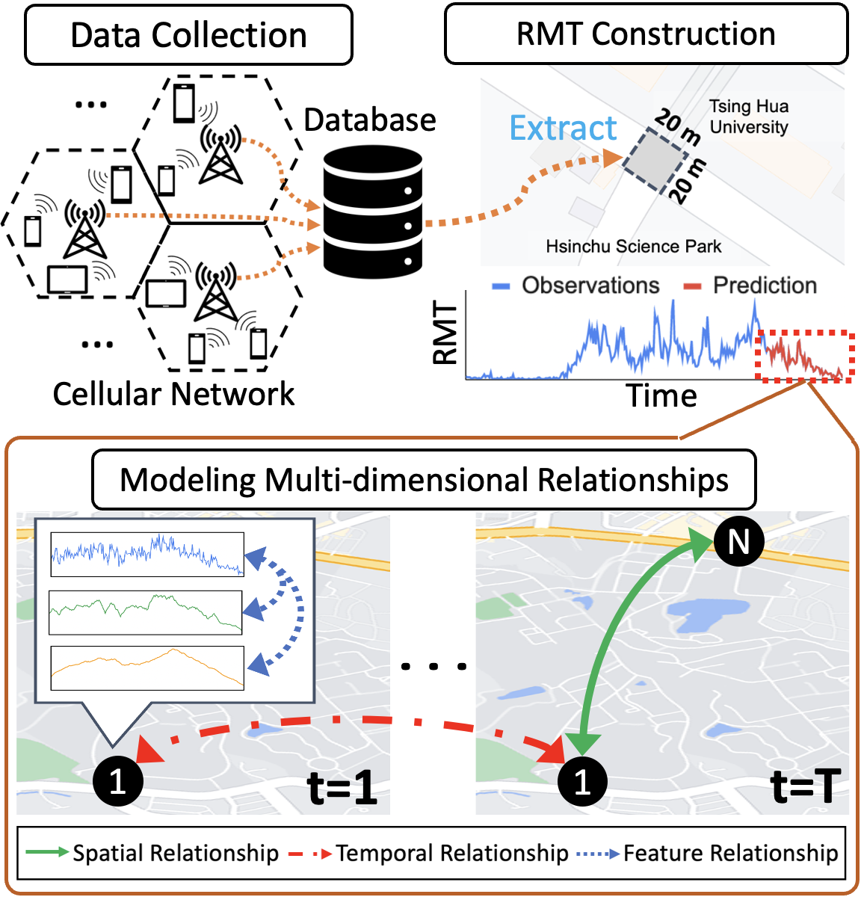
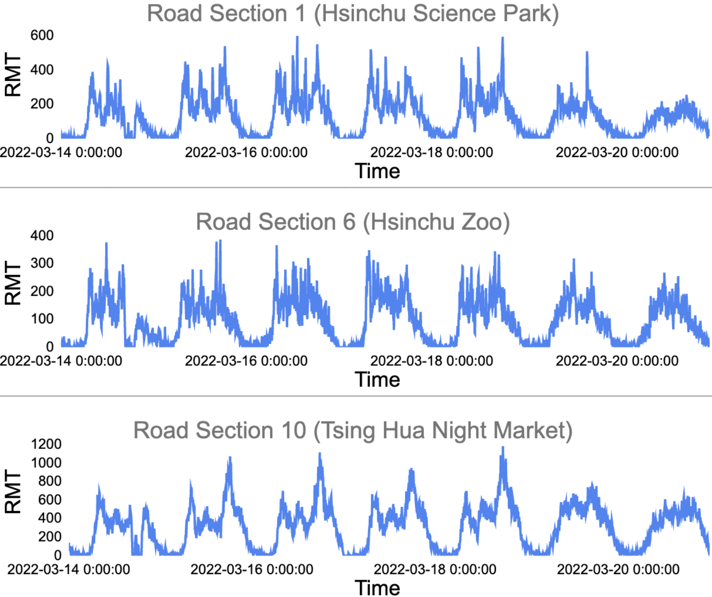
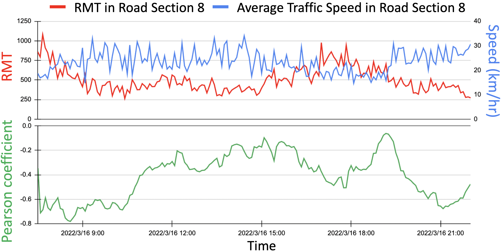
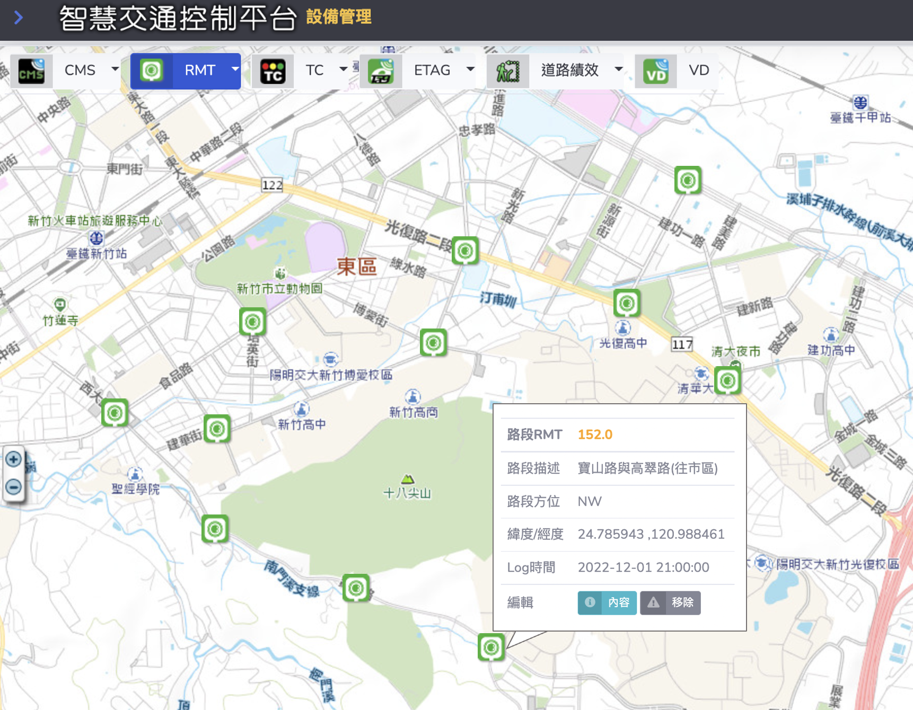

# Supplemental Material Providing for SIGKDD'23

This is the original Supplemental Material for SIGKDD'23, with Dataset and Source Code for RMT and GMAT-Net

This prototypical dataset cooperated with [Chunghwa Telecom Company](https://www.cht.com.tw/en/home/cht), the leading telecommunication company in Taiwan with over 10 million mobile subscribers and accounted for over 50% population.

The dataset materials are provided in the following.

The experimental model codes are provided in: `./model`

## Overview
The overall process of the proposed spatial-temporal dataset and prediction task.

new spatial-temporal task and dataset.

## Training/Test/Validation Data

The Training/Test/Validation (.npz) is providing at ./model/Data

We split 7:2:1 as  Training/Test/Validation files. 

## RMT (Road Mobile Traffic) Dataset

We proposed a new spatial-temporal dataset, the RMT Dataset, consisting of RMT time series among multiple road sections. 

RMT Dataset combines the mobility of mobile users into road section topology, resulting in more spatial-temporal potential.

### RMT Definition
RMT refers to the accumulation of cellular traffic over fixed time intervals of a road section, which can reflect crowdedness in a region.

We collected cellular traffic from Chunghwa Telecom's cellular traffic storage database, which received and stored over 2 billion daily mobile user cellular traffic records.

*Please note:*
All authors abide by strict information security regulations for telecom data, and only employee authors have access to the cellular traffic storage database. And all cellular records are anonymized by hashing before being aggregated into RMT.

### Spatial Property

Road Sections in Hsinchu City, Taiwan.

These road sections are geographically connected to constitute a network, generating more spatial correlations. 

### Temporal Property

Examples of RMT time series. 

Each RMT time series has its temporal pattern based on the surrounding environment.

## Experimental Materials Providing 

### (0). Training Model
The model code for GMAT-Net will be provided in: `./model`

### (1). Graph Structure of Road Section Network
As the implementation is based on pre-calculated distances between road sections, we provided the CSV file with road section distances and IDs: [Road_Section_Distance.csv](https://drive.google.com/file/d/1T4SAfwdLSAtR6hcPL-BmHzbEjdtlJEfc/view?usp=share_link). 

To generate the Graph Structure based on the `Road_Section_Distance.csv` file provided above, please execute the [script](https://github.com/liyaguang/DCRNN/blob/master/scripts/gen_adj_mx.py). 

The `processed Graph Structure` used in experiments are available at: [Google Drive](https://drive.google.com/file/d/1pWSCuEsGLT93ggR3asCeOVuuX5btliOR/view?usp=share_link)     

### (2). RMT dataset for training

The original RMT series data are available at: [RMT_2022_nodes_11](https://drive.google.com/file/d/19Oh5zRBih6wchi5mTwJW1OAsX0nw7Ppf/view?usp=share_link). 
Here are the partital examples of RMT series:

|                     | Road Section 1 | Road Section 2 | Road Section 3 | ... | Road Section 11 |
|:-------------------:|:--------------:|:--------------:|:--------------:|:--------------:|:--------------:|
| 2022-01-01 0:00:00 |   24.0        |   1.0        |   16.0        |    ...         |    37.0         |
|         ...         |    ...         |    ...         |    ...         |    ...         |    ...         |
| 2022-03-16 18:00:00 |   330.0        |   43.0        |   322.0        |    ...         |    269.0         |
| 2022-03-16 18:05:00 |   281.0        |   42.0        |   348.0        |    ...         |    212.0         |
| 2022-03-16 18:10:00 |   401.0        |   70.0         |   240.0        |    ...         |    289.0         |
|         ...         |    ...         |    ...         |    ...         |    ...         |    ...         |
| 2022-03-31 23:55:00 |   54.0        |   9.0        |   51.0        |    ...         |    38.0         |

To generate train/test/val dataset as  {train,val,test}.npz for the experiments, please follow the reference [script](https://github.com/liyaguang/DCRNN/blob/master/scripts/generate_training_data.py) with our providing dataset: [RMT_2022_nodes_11](https://drive.google.com/file/d/19Oh5zRBih6wchi5mTwJW1OAsX0nw7Ppf/view?usp=share_link)

The `processed train/val/test data structures` are available at: [Google Drive](https://drive.google.com/drive/folders/13ERd3wZFOe41RJ8CXyg_Q9U5XaS_HYrz?usp=share_link)

### (3). Feature Augmentation of RMT dataset

We adopted our proposed Feature Augmentation to convert the univariate feature (e.g., traffic speed / Traffic Flow / RMT) into multivariate features with linear and nonlinear components, enhancing the diversity of the dataset. 

We employed 'Moving Average (MA)' and 'Geometric Average (GA)' as the linear and nonlinear components respectively.

The linear and nonlinear components can be first calculated mathematically based on [RMT_2022_nodes_11](https://drive.google.com/file/d/19Oh5zRBih6wchi5mTwJW1OAsX0nw7Ppf/view?usp=share_link), and then processed with the same [script](https://github.com/liyaguang/DCRNN/blob/master/scripts/generate_training_data.py) to generate corresponding train/val/test datasets.

The `processed train/val/test of Feature Augmentation` are available at: [Google Drive](https://drive.google.com/drive/folders/1NrRM7VW48XgOVr9dV2hW4thh5VR1XqdF?usp=share_link). 

## Other Materials Providing 

### (1). The data of Hashed Table

The original `hashed cellular traffic files` of each road section are available at: [Google Drive](https://drive.google.com/drive/folders/15aN_zvN6qDEbpQBIIlQ7BBQOvwLoaqnq?usp=share_link)   

We hope these archives will lead to more promising potentials for urban computing applications.

## Examples of Future Extended Potential

### (1). Indicators of Transportation

In our work, we demonstrated the relationship between average speed and RMT and used Pearson coefficient analysis to verify the negative correlation characteristics of the two.

This can be extended to the indicators of transportation, such as determining 
traffic congestion.

### (2). Crowdedness Monitoring

We cooperated with the city transportation agency to integrate RMT into the Traffic Control System, providing managers with a new visualization for crowdedness monitoring.

