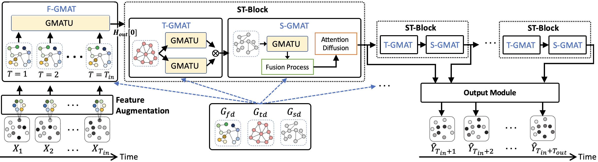

# Experimental Code for: Graph Multichannel Attention Neural Network (GMAT-Net)

This is a Pytorch implementation of Graph Multichannel Attention Neural Network for SIGKDD'23

## Data Preparation
The original RMT data files, i.e., `RMT_2022_nodes_11.csv`, are available at [Google Drive](https://drive.google.com/file/d/19Oh5zRBih6wchi5mTwJW1OAsX0nw7Ppf/view?usp=share_link)

Here is an example:

|                     | Road Section 1 | Road Section 2 | Road Section 3 | ... | Road Section N |
|:-------------------:|:--------------:|:--------------:|:--------------:|:--------------:|:--------------:|
| 2022-01-01 0:00:00 |   24.0        |   1.0        |   16.0        |    ...         |    37.0         |
|         ...         |    ...         |    ...         |    ...         |    ...         |    ...         |
| 2022-03-16 18:00:00 |   330.0        |   43.0        |   322.0        |    ...         |    269.0         |
| 2022-03-16 18:05:00 |   281.0        |   42.0        |   348.0        |    ...         |    212.0         |
| 2022-03-16 18:10:00 |   401.0        |   70.0         |   240.0        |    ...         |    289.0         |
|         ...         |    ...         |    ...         |    ...         |    ...         |    ...         |
| 2022-03-31 23:55:00 |   54.0        |   9.0        |   51.0        |    ...         |    38.0         |

### train/test/val dataset

The train/test/val data is now providing at : ./Data

We split data in 7:2:1 for generating train/test/val data.

---- How to Create ----

Run the [scripts](https://github.com/liyaguang/DCRNN/blob/master/scripts/generate_training_data.py) to generate the train/test/val dataset.

We provided `the processed train/val/test datasets` in the link: [Google Drive](https://drive.google.com/drive/folders/13ERd3wZFOe41RJ8CXyg_Q9U5XaS_HYrz?usp=share_link)

### train/test/val of Feature Augmentation

The linear and nonlinear components of Feature Augmentation can be calculated mathematically (i.e., 'Mean Average' and 'Geometric Average') with the original RMT data file: [RMT_2022_nodes_11.csv](https://drive.google.com/file/d/19Oh5zRBih6wchi5mTwJW1OAsX0nw7Ppf/view?usp=share_link)

Then run the same [script](https://github.com/liyaguang/DCRNN/blob/master/scripts/generate_training_data.py) to generate datasets.

We also provided `the processed linear and nonlinear components` as train/val/test datasets at ./Data

## Graph Construction
As the implementation is based on pre-calculated distances between road sections, we provided the CSV file with road section distances and IDs in the following link: [Road Section Distance](https://drive.google.com/file/d/1T4SAfwdLSAtR6hcPL-BmHzbEjdtlJEfc/view?usp=share_link). 

Run the [script](https://github.com/liyaguang/DCRNN/blob/master/scripts/gen_adj_mx.py) to generate the Graph Structure based on the "Road Section Distance" file provided above.

The `processed Graph Structure of Road Section Network`, i.e., `adj_mat_RMThsin.pkl`, are available at: [Google Drive](https://drive.google.com/file/d/1pWSCuEsGLT93ggR3asCeOVuuX5btliOR/view?usp=share_link)   

## Model Training

The code for each part of the framework architecture is provided above.

Please set the location of the dataset and graph structure file in `argparse.ArgumentParser()` of `parameters.py`

And put all codes together to run the training process.

Or run the `Jupyter Notebook` for model training with `GMAT_Net.ipynb` and `GMAT_Uni.ipynb`(i.e., with univariate input).

